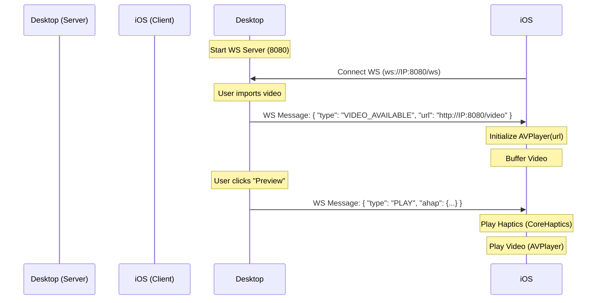

# iOS Real-Time Preview with Video & Haptics

This document outlines how to implement the iOS companion app that receives both **Haptic Patterns (AHAP)** and **Video Streams** from the Desktop Editor.

## 1. Architecture

The system uses a hybrid **WebSocket + HTTP** architecture for maximum performance and standard compliance.

*   **Control Plane (WebSocket)**: Used for real-time haptic data (JSON), playback commands, and status updates.
*   **Data Plane (HTTP)**: Used for streaming the video file. The desktop acts as a web server hosting the video file.



## 2. WebSocket Protocol

Messages sent from Desktop to iOS are JSON strings.

### 2.1 Video Available
Sent when a video is loaded or when a client first connects if a video is present. The URL will now dynamically use the correct local IP of the desktop.

```json
{
  "type": "VIDEO_AVAILABLE",
  "url": "http://192.168.1.X:8080/video" 
}
```

*Note: The Desktop app now persists the video path across reloads. If a video was previously imported, the `VIDEO_AVAILABLE` message will be sent immediately upon connection.*

### 2.2 Play Haptics (Preview)
Sent when the user triggers a preview.
```json
{
  "Version": 1.0,
  "Pattern": [...]
}
```
*Note: Currently, the raw AHAP JSON is sent directly. If the JSON contains a top-level `Pattern` key, treat it as a haptic pattern.*

## 3. iOS Implementation Guide

### 3.1 Dependencies
*   **SwiftUI**: UI Framework.
*   **CoreHaptics**: For playing AHAP.
*   **AVKit / AVFoundation**: For playing video.

### 3.2 Video Player (`VideoPlayerManager`)
Create an `ObservableObject` to manage the `AVPlayer`.

```swift
import AVKit

class VideoPlayerManager: ObservableObject {
    @Published var player: AVPlayer?
    
    func loadVideo(url: URL) {
        let playerItem = AVPlayerItem(url: url)
        self.player = AVPlayer(playerItem: playerItem)
    }
    
    func play() {
        player?.seek(to: .zero)
        player?.play()
    }
    
    func stop() {
        player?.pause()
        player?.seek(to: .zero)
    }
}
```

### 3.3 WebSocket Handling
Update `WebSocketManager` to parse incoming messages.

```swift
func receiveMessage() {
    webSocketTask?.receive { [weak self] result in
        switch result {
        case .success(let message):
            switch message {
            case .string(let text):
                self?.handleMessage(text)
            // ...
            }
            self?.receiveMessage()
        // ...
        }
    }
}

func handleMessage(_ text: String) {
    if let data = text.data(using: .utf8),
       let json = try? JSONSerialization.jsonObject(with: data) as? [String: Any] {
        
        // Check for Control Messages
        if let type = json["type"] as? String {
            if type == "VIDEO_AVAILABLE", let urlString = json["url"] as? String {
                // Replace <HOST> if needed, or use as provided
                // Trigger Video Load
                DispatchQueue.main.async {
                    self.onVideoUrlReceived?(urlString)
                }
                return
            }
        }
        
        // Fallback: Treat as AHAP
        DispatchQueue.main.async {
            self.onHapticReceived?(text)
        }
    }
}
```

### 3.4 Synchronization
To ensure haptics and video play in sync:
1.  When "Preview" is received:
    *   Prepare Haptic Engine.
    *   Reset Video Player to start (`seek(to: .zero)`).
    *   Start Haptics.
    *   Start Video.

*Note: For tighter sync, you can use `CHHapticAdvancedPatternPlayer` and schedule the start, but for preview purposes, firing both immediately is usually sufficient (<30ms latency).*

### 3.5 UI Integration
Use `VideoPlayer` from `AVKit` in your SwiftUI view.

```swift
import SwiftUI
import AVKit

struct ContentView: View {
    @StateObject var wsManager = WebSocketManager()
    @StateObject var videoManager = VideoPlayerManager()
    @StateObject var hapticManager = HapticManager()
    
    var body: some View {
        ZStack {
            if let player = videoManager.player {
                VideoPlayer(player: player)
                    .edgesIgnoringSafeArea(.all)
            } else {
                Text("Waiting for Video...")
            }
            
            // Overlay Controls
            VStack {
                // Connection Status
                // ...
            }
        }
        .onAppear {
            wsManager.onVideoUrlReceived = { urlStr in
                // Fix localhost/IP if needed
                if let url = URL(string: urlStr) {
                    videoManager.loadVideo(url: url)
                }
            }
            
            wsManager.onHapticReceived = { ahapJson in
                hapticManager.playAHAP(jsonString: ahapJson)
                videoManager.play()
            }
        }
    }
}
```

## 4. Summary
1.  **Desktop** serves video at `/video`.
2.  **Desktop** sends `VIDEO_AVAILABLE` event with URL.
3.  **iOS** loads URL into `AVPlayer`.
4.  **Desktop** sends AHAP JSON.
5.  **iOS** triggers `haptics.play()` and `video.play()` simultaneously.
