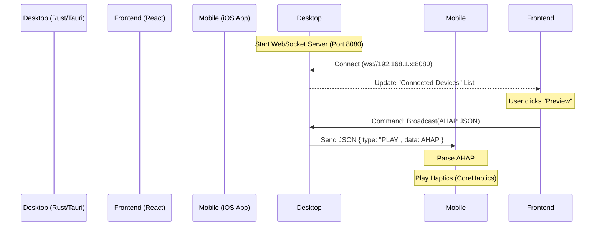

# Real-Time Preview Mode: Implementation Plan & Documentation

## 1. Overview
The **Real-Time Preview Mode** allows users to connect a mobile device (iOS/Android) to the Haptic Editor running on a desktop. When the user clicks "Preview" (or edits in "Auto" mode), the current haptic pattern (AHAP) is instantly sent to the mobile device for playback using its native haptic engine.

## 2. Architecture

The system uses a **Local WebSocket Network** architecture.

*   **Server (Desktop)**: The Tauri application (Rust backend) hosts a WebSocket server on a specific port (e.g., `8080`).
*   **Client (Mobile)**: The mobile app connects to the Desktop's IP address via WebSocket.
*   **Communication**:
    *   **Handshake**: Mobile connects, identifies itself (e.g., "iPhone 13").
    *   **Payload**: Desktop sends JSON messages containing the AHAP pattern and playback commands.



## 3. Desktop Implementation (Rust/Tauri)

### 3.1 Dependencies
Add the following to `src-tauri/Cargo.toml`:
```toml
[dependencies]
warp = "0.3" # or axum, for WebSocket server
tokio = { version = "1", features = ["full"] }
serde = { version = "1.0", features = ["derive"] }
serde_json = "1.0"
local-ip-address = "0.5" # To display Desktop IP to user
once_cell = "1.18" # For global state management
futures-util = "0.3"
```

### 3.2 WebSocket Server Logic
We need a global state to hold active connections.

```rust
// src-tauri/src/server.rs (New File)
use std::sync::{Arc, Mutex};
use std::collections::HashMap;
use warp::Filter;
use tokio::sync::mpsc;

type Clients = Arc<Mutex<HashMap<String, mpsc::UnboundedSender<Message>>>>;

pub async fn start_server(clients: Clients) {
    let clients_filter = warp::any().map(move || clients.clone());
    let ws_route = warp::path("ws")
        .and(warp::ws())
        .and(clients_filter)
        .map(|ws: warp::ws::Ws, clients| {
            ws.on_upgrade(move |socket| handle_connection(socket, clients))
        });

    warp::serve(ws_route).run(([0, 0, 0, 0], 8080)).await;
}
```

### 3.3 Tauri Commands
Expose commands to the frontend to manage the server and send data.

```rust
// src-tauri/src/main.rs

#[tauri::command]
async fn get_local_ip() -> String {
    local_ip_address::local_ip().unwrap().to_string()
}

#[tauri::command]
async fn broadcast_preview(ahap_json: String) {
    // Iterate over connected clients and send the JSON
}
```

## 4. Frontend Implementation (React)

### 4.1 UI Components
1.  **Device Panel**:
    *   Display the **Desktop IP Address** (QR Code generation recommended for easy scanning by mobile app).
    *   List connected devices (e.g., "iPhone 13 - Connected").
    *   Status indicator (Server Running/Stopped).

2.  **Preview Controls**:
    *   **"Preview on Device" Button**: Triggers `broadcast_preview`.
    *   **"Auto-Preview" Toggle**: If enabled, triggers `broadcast_preview` on every debounce(500ms) of timeline changes.

## 5. iOS Implementation (SwiftUI)

This is a standalone iOS app.

### 5.1 Requirements
*   **Language**: Swift 5+
*   **Framework**: SwiftUI
*   **Haptics**: CoreHaptics
*   **Networking**: URLSession (Native WebSocket support)

### 5.2 Code Structure

#### `HapticManager.swift`
Handles the CoreHaptics engine.

```swift
import CoreHaptics

class HapticManager: ObservableObject {
    private var engine: CHHapticEngine?
    
    init() {
        prepareHaptics()
    }
    
    func prepareHaptics() {
        guard CHHapticEngine.capabilitiesForHardware().supportsHaptics else { return }
        do {
            engine = try CHHapticEngine()
            try engine?.start()
        } catch {
            print("Haptic engine error: \(error)")
        }
    }
    
    func playAHAP(jsonString: String) {
        guard let engine = engine else { return }
        
        // Save JSON to temp file (CHHapticEngine reads from file or dictionary)
        let fileName = "temp_preview.ahap"
        let url = FileManager.default.temporaryDirectory.appendingPathComponent(fileName)
        
        do {
            try jsonString.write(to: url, atomically: true, encoding: .utf8)
            try engine.playPattern(from: url)
        } catch {
            print("Failed to play AHAP: \(error)")
        }
    }
}
```

#### `WebSocketManager.swift`
Handles connection to Desktop.

```swift
import Foundation

class WebSocketManager: ObservableObject {
    private var webSocketTask: URLSessionWebSocketTask?
    @Published var isConnected = false
    var onReceiveMessage: ((String) -> Void)?
    
    func connect(ip: String, port: String = "8080") {
        let urlString = "ws://\(ip):\(port)/ws"
        guard let url = URL(string: urlString) else { return }
        
        webSocketTask = URLSession.shared.webSocketTask(with: url)
        webSocketTask?.resume()
        receiveMessage()
        isConnected = true
    }
    
    private func receiveMessage() {
        webSocketTask?.receive { [weak self] result in
            switch result {
            case .failure(let error):
                print("Error: \(error)")
                self?.isConnected = false
            case .success(let message):
                switch message {
                case .string(let text):
                    DispatchQueue.main.async {
                        self?.onReceiveMessage?(text)
                    }
                case .data(let data):
                    // Handle binary if needed
                    break
                @unknown default:
                    break
                }
                self?.receiveMessage() // Listen for next message
            }
        }
    }
}
```

#### `ContentView.swift`
Main UI.

```swift
import SwiftUI

struct ContentView: View {
    @StateObject var wsManager = WebSocketManager()
    @StateObject var hapticManager = HapticManager()
    @State private var ipAddress = "192.168.1.X" // User inputs desktop IP
    
    var body: some View {
        VStack(spacing: 20) {
            Text("Haptic Preview Client")
                .font(.title)
            
            TextField("Desktop IP", text: $ipAddress)
                .textFieldStyle(RoundedBorderTextFieldStyle())
                .keyboardType(.decimalPad)
                .padding()
            
            Button(wsManager.isConnected ? "Connected" : "Connect") {
                wsManager.connect(ip: ipAddress)
            }
            .disabled(wsManager.isConnected)
            
            if wsManager.isConnected {
                Image(systemName: "iphone.gen3.radiowaves.left.and.right")
                    .font(.largeTitle)
                    .foregroundColor(.green)
                Text("Waiting for preview...")
            }
        }
        .onAppear {
            wsManager.onReceiveMessage = { message in
                // Assume message is raw AHAP JSON or wrapped JSON
                // If wrapped: let ahap = parse(message).data
                hapticManager.playAHAP(jsonString: message)
            }
        }
    }
}
```

## 6. Workflow Summary

1.  **Start Desktop App**: Server starts automatically on port 8080.
2.  **Open iOS App**: Enter Desktop IP (displayed on Desktop App) and tap "Connect".
3.  **Edit & Preview**:
    *   **Manual**: User makes edits in Desktop App -> Clicks "Preview" -> Haptics play on phone.
    *   **Auto**: User enables "Auto-Preview" -> Dragging a slider or changing a value immediately triggers playback on phone (debounced).

## 7. Future Improvements
*   **Video Sync**: Send a timestamp along with the AHAP. The iOS app would need to load the video file (perhaps uploaded via HTTP server on Desktop) and seek to the timestamp.
*   **Bi-directional Sync**: Scrubbing on mobile updates desktop timeline.
